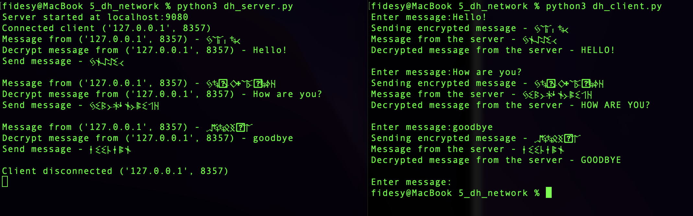

# Алгоритмы асимметричного шифрования

Пример работы. Сервер/клиент. 

Клиент подключается к серверу и выполняется функция exchangeKeys на [сервере](./dh_server.py#L41-L49) и [клиенте](./dh_client.py#L29-L38),
в результате генерируется общий секретный ключ.

Клиент вводит сообщение, оно шифруется секретным ключом и посылается серверу. 
Сервер принимает сообщение, расшифровывает ключом и генерирует свое сообщение.
В итоге передаются только зашифрованные сообщения.

